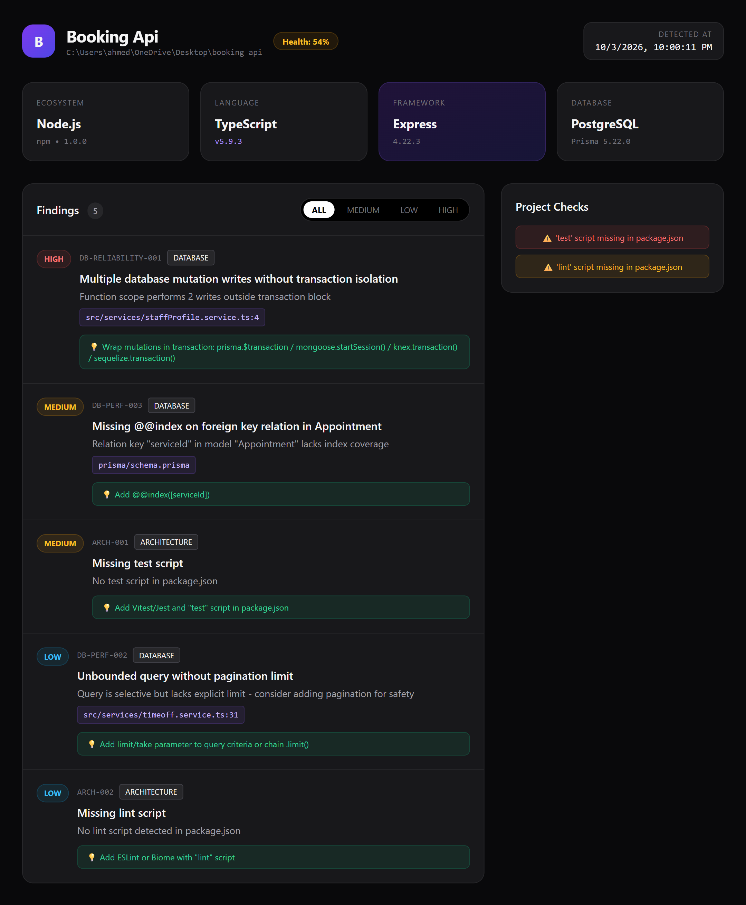

<p align="center">
  <h1 align="center">backend-engineering-mcp</h1>
  <p align="center">
    Local-first Backend Engineering MCP — evidence-based project detection, deterministic AST analyzers (SQL + NoSQL), live HTML dashboard, and AI-assisted audit review.
  </p>
</p>

<p align="center">
  
  
  
  
  
</p>

---

## Why

Backend audits are either **fast but shallow** (regex linters) or **deep but manual** (senior code review). This MCP combines both:

- **Deterministic AST analyzers** via `ts-morph` — reproducible and traceable to file:line.
- **Evidence-first detection** — never guesses. Every value has `evidence`, `source`, and `confidence`.
- **AI review on top of facts** — the LLM only prioritizes and explains findings. No hallucination, no severity override.

**Philosophy:** `Evidence → Detection → Deterministic AST Analyzers → AI Review → Unified Audit & Live Dashboard`

> Runs **locally** on a path you provide. **Zero external services, no Docker, no Cloud — pure AST in seconds.**

## Demo


> Live dashboard served after `run_full_audit` — Health score, findings by severity, and file:line traceability.

## Architecture

```text
Target Project Path
       │
       ▼
┌─────────────────────────────────────────────┐
│  Detection Layer                            │
│  ProjectDetector ─ readers: package.json,   │
│  lockfile, .env, scripts, structure,        │
│  SQL/NoSQL drivers (pg, mysql2, mongoose)   │
│  → ProjectProfile { value, confidence,      │
│      evidence[] } per dimension             │
└─────────────────────────────────────────────┘
       │
       ▼
┌──────────────────────┐   ┌────────────────────┐
│ Source Scanners      │   │ Evidence Collection│
└──────────────────────┘   └────────────────────┘
       └─────────────┬─────────────┘
                     ▼
     ┌───────────────────────────────┐
     │  Deterministic AST Analyzers  │
     │  • Security (rules engine)    │
     │  • Database SQL + NoSQL       │
     │  • Architecture               │
     └───────────────────────────────┘
                     ▼
          AuditFinding[] (deduplicated, ranked)
                     ▼
     ┌───────────────────────────────┐
     │  AI Review (MCP prompt)       │
     └───────────────────────────────┘
                     ▼
   reports/latest/audit.json  +  public/audit.json + Dashboard
```

## Features

### Evidence-based project detection
Auto-detects per dimension with supporting evidence:

| Dimension | Sources used |
|---|---|
| Ecosystem, Language, TypeScript | `package.json`, `tsconfig.json` |
| Package Manager | `package-lock.json`, `yarn.lock`, `pnpm-lock.yaml` |
| Framework, Runtime | dependencies, `engines`, source imports |
| Database + ORM | `mongoose` schemas, SQL drivers (`pg`, `mysql2`, `knex`, `sequelize`), connection strings |
| Scripts, Structure, Entry point | `package.json` scripts, directory layout |
| Tooling | config files, dependencies |

Every value is `DetectedValue<T>`: `{ value, confidence, evidence[], declaredVersion?, installedVersion? }`.

### Deterministic AST analyzers
- **Security** — hardcoded secrets, `.env` exposure, SQL/NoSQL injection (`$where`, `$regex`, operator injection).
- **Database SQL + NoSQL** — `strict: false`, `synchronize:true`, missing indexes on `ref` fields, unbounded queries (`.limit()` / `take`), N+1, missing transactions.
- **Architecture** — missing `test`/`lint` scripts and structural gaps.

### Scoring & Reports
- Health score `0–100` and Risk `SAFE | LOW | MEDIUM | HIGH | CRITICAL`
- Writes `reports/latest/audit.json` + `public/audit.json` and serves live Dashboard

### MCP Server (stdio)

| Tool / Prompt | Input | Output |
|---|---|---|
| `get_project_profile` | `projectPath` | `ProjectProfile` with evidence |
| `run_full_audit` | `projectPath` | `{ profile, findings, total, dashboardUrl }` |
| `review_audit` | `{ profile, findings }` | System-prompt for AI review |
| `audit-review` (prompt) | — | Evidence-first instructions |

## Tech Stack

| Layer | Technology |
|---|---|
| Language | TypeScript 5.7 (`strict`, `exactOptionalPropertyTypes`) |
| Runtime | Node.js 20+ (ESM, `NodeNext`) |
| Protocol | Model Context Protocol SDK (`stdio`) |
| AST engine | `ts-morph` |
| Validation | `zod` |
| Execution | `tsx` (dev), `tsc` (build) |

## Getting Started

### Prerequisites
- Node.js 20+
- npm

### Install

```bash
git clone https://github.com/magedo992/backend-engineering-mcp.git
cd backend-engineering-mcp
npm install
npm run build
```

### Register the MCP server

```json
{
  "mcpServers": {
    "backend-auditor": {
      "command": "node",
      "args": ["C:/path/to/backend-engineering-mcp/dist/index.js"]
    }
  }
}
```

## Usage

```bash
npm run dev      # run from source (tsx)
npm run build    # compile to dist/
npm start        # run compiled server
```

From your MCP client:
```text
run_full_audit({ "projectPath": "C:/code/my-backend-api" })
get_project_profile({ "projectPath": "C:/code/my-backend-api" })
```

## Unified Data Contract

```typescript
export interface AuditFinding {
  id: string;
  source: string; // 'security-analyzer' | 'database-analyzer' | 'query-analyzer'
  severity: 'BLOCKER' | 'CRITICAL' | 'HIGH' | 'MEDIUM' | 'LOW' | 'INFO';
  category: 'SECURITY' | 'DATABASE' | 'ARCHITECTURE' | 'RELIABILITY' | 'OTHER';
  title: string;
  message: string;
  file?: string;
  line?: number;
  evidence?: string;
  recommendation?: string;
}
```

**Example `audit.json`:**

```json
{
  "generatedAt": "2026-10-03T21:16:09.949Z",
  "profile": { "framework": "Express", "database": "PostgreSQL", "orm": "Prisma" },
  "findings": [
    {
      "id": "DB-RELIABILITY-001",
      "source": "query-analyzer",
      "severity": "HIGH",
      "category": "DATABASE",
      "title": "Multiple database mutation writes without transaction isolation",
      "file": "src/services/staffProfile.service.ts",
      "line": 4,
      "recommendation": "Wrap mutations in transaction: prisma.$transaction"
    }
  ]
}
```

## Project Structure

```text
backend-engineering-mcp/
├── reports/latest/      # audit.json (machine-readable)
├── public/              # audit.json for dashboard
├── src/
│   ├── analyzers/       # security, database (SQL+NoSQL), structure
│   ├── detection/       # detectors + readers
│   ├── mcp/             # tools + prompts
│   ├── orchestrator/    # AuditOrchestrator
│   ├── scanners/        # file/route/db scanners
│   ├── server/          # dashboard-server
│   ├── types/           # AuditFinding, ProjectProfile
│   └── index.ts
```

## Roadmap

| Phase | Item | Status |
|---|---|---|
| 1 | Project detection with evidence & confidence | ✅ Done |
| 2 | Pure AST Security & Database (SQL+NoSQL) | ✅ Done |
| 3 | MCP tools + Dashboard | ✅ Done |
| 4 | Runtime hardening (`.nvmrc`, `engines`) | 🚧 In progress |
| 5 | OpenAPI / Swagger analyzer | 📅 Planned |
| 6 | Tests & CI pipeline | 📅 Planned |
| 7 | Publish to npm | 📅 Planned |

## Contributing

1. Emit findings via `AuditFinding` in `src/types/audit.types.ts`
2. Every finding must have `file` + `evidence` — no guesses
3. Never log secrets or raw `.env` values
4. Use `ts-morph` AST, not regex

## License

MIT
